Прочитав данный раздел, вы научитесь:
1. Настраивать адаптеры к БД.
2. Создавать сущности.
3. Создавать конвейеры.
4. Создавать бизнес-адаптеры и триггеры.
5. Активировать интеграцию.


## Создание демонстрационных БД-источника и БД-приемника


В качестве примера интеграции создадим две БД **T2.DemoSourceDB** и **T2.DemoTargetDB** на существующем инстансе **MS SQL Server**. В каждой такой БД будет создана таблица с именем **HelloWorld** с полями **Id** и **Text**. В БД **T2.DemoSourceDB** вставим одну запись со значениями **Id** = *1* и **Text** = *Hello World from T2.DemoSourceDB!*. В БД **T2.DemoTargetDB** таблица **HelloWorld** изначально будет пустой.

Откройте **Microsoft SQL Server Management Studio** и выполните следующий скрипт (у пользователя должны быть соответствующие права на создание баз данных; как вариант - роль **sysadmin**):

    SET NOCOUNT ON
    GO
    
    -- T2.DemoSourceDB
    USE master
    GO
    
    IF EXISTS (SELECT * FROM sysdatabases WHERE name = 'T2.DemoSourceDB')
      DROP DATABASE [T2.DemoSourceDB];
    GO
    
    DECLARE @device_directory NVARCHAR(520);
    
    SELECT
      @device_directory = SUBSTRING(filename, 1, CHARINDEX(N'master.mdf', LOWER(filename)) - 1)
    FROM
      master.dbo.sysaltfiles
    WHERE
      dbid = 1 AND fileid = 1;
    
    EXECUTE 
    ( 
      N'CREATE DATABASE [T2.DemoSourceDB]
        ON PRIMARY (NAME = N''T2.DemoSourceDB'', FILENAME = N''' + @device_directory + N'T2.DemoSourceDB.mdf'')
        LOG ON (NAME = N''T2.DemoSourceDB_log'',  FILENAME = N''' + @device_directory + N'T2.DemoSourceDB.ldf'')'
    )
    GO
    
    IF CAST(SERVERPROPERTY('ProductMajorVersion') AS INT) < 12 
    BEGIN
      EXEC sp_dboption 'T2.DemoSourceDB', 'trunc. log on chkpt.', 'true'
      EXEC sp_dboption 'T2.DemoSourceDB', 'select into/bulkcopy', 'true'
    END
    ELSE
      ALTER DATABASE [T2.DemoSourceDB] SET RECOVERY SIMPLE WITH NO_WAIT
    GO
    
    SET QUOTED_IDENTIFIER ON
    GO
    
    USE [T2.DemoSourceDB]
    GO
    
    IF EXISTS (SELECT * FROM sysobjects WHERE id = object_id('dbo.HelloWorld') and sysstat & 0xf = 3)
      DROP TABLE "dbo"."HelloWorld"
    GO
    
    CREATE TABLE "HelloWorld"
    (
      "Id"   INT IDENTITY (1, 1) NOT NULL,
      "Text" NVARCHAR (100) NULL
      CONSTRAINT "PK_HelloWorld" PRIMARY KEY CLUSTERED 
      (
        "Id"
      )
    )
    GO
    
    INSERT "HelloWorld" ("Text") VALUES('Hello World from T2.DemoSourceDB!');
    GO
    
    -- T2.DemoTargetDB
    USE master
    GO
    
    IF EXISTS (SELECT * FROM sysdatabases WHERE name = 'T2.DemoTargetDB')
      DROP DATABASE [T2.DemoTargetDB];
    GO
    
    DECLARE @device_directory NVARCHAR(520);
    
    SELECT
      @device_directory = SUBSTRING(filename, 1, CHARINDEX(N'master.mdf', LOWER(filename)) - 1)
    FROM
      master.dbo.sysaltfiles
    WHERE
      dbid = 1 AND fileid = 1;
    
    EXECUTE 
    ( 
      N'CREATE DATABASE [T2.DemoTargetDB]
        ON PRIMARY (NAME = N''T2.DemoTargetDB'', FILENAME = N''' + @device_directory + N'T2.DemoTargetDB.mdf'')
        LOG ON (NAME = N''T2.DemoTargetDB_log'',  FILENAME = N''' + @device_directory + N'T2.DemoTargetDB.ldf'')'
    )
    GO
    
    IF CAST(SERVERPROPERTY('ProductMajorVersion') AS INT) < 12 
    BEGIN
      EXEC sp_dboption 'T2.DemoTargetDB', 'trunc. log on chkpt.', 'true'
      EXEC sp_dboption 'T2.DemoTargetDB', 'select into/bulkcopy', 'true'
    END
    ELSE
      ALTER DATABASE [T2.DemoTargetDB] SET RECOVERY SIMPLE WITH NO_WAIT
    GO
    
    SET QUOTED_IDENTIFIER ON
    GO
    
    USE [T2.DemoTargetDB]
    GO
    
    IF EXISTS (SELECT * FROM sysobjects WHERE id = object_id('dbo.HelloWorld') and sysstat & 0xf = 3)
      DROP TABLE "dbo"."HelloWorld"
    GO
    
    CREATE TABLE "HelloWorld"
    (
      "Id"   INT IDENTITY (1, 1) NOT NULL,
      "Text" NVARCHAR (100) NULL
      CONSTRAINT "PK_HelloWorld" PRIMARY KEY CLUSTERED 
      (
        "Id"
      )
    )
    GO

Выполните команду чтения данных в БД-источнике:
  
    SELECT * FROM [T2.DemoSourceDB].[dbo].[HelloWorld];

Результатом будет строка следующего вида:

    Id   Text
    ---  ----------------------------------------------
      1  Hello World from T2.DemoSourceDB!

Выполните команду чтения данных в БД-приемнике:

    SELECT * FROM [T2.DemoTargetDB].[dbo].[HelloWorld];

Результат будет пустым:

    Id   Text
    ---  ----------------------------------------------

## Настройка и запуск адаптера для БД-источника

Установите адаптер **T2.DIP.Adapter.DB** для БД-источника.

В каталоге адаптера в файле **appsettings.json** укажите актуальные значения следующих параметров:

```json title="T2.Integration\Config\T2.DIP.Adapter.DemoSourceDB\$CustomConfig-T2.DIP.Adapter.DemoSourceDB\appsettings.json"
{
  ...
  "AppSettings": {
    ...
    "MassTransit": {
      ...
      "HostName": "localhost",
      "VirtualHost": "DIP",
      "UserName": "dip",
      "Password": "dip"
    },
    "NuGetPackage": {
      "Repository": "C:\\T2.Integration\\LocalPackages"
    }
  },

  "ConnectionStrings": {
    "AdapterConnectionString": {
      "ConnectionString": "Data Source=BY01-1229.topsoft.local\\SQL2016;Initial Catalog=T2.DemoSourceDB;Integrated Security=True",
      ...
    },
    "DIPConnectionString": {
      "ConnectionString": "Data Source=BY01-1229.topsoft.local\\SQL2016;Initial Catalog=T2.DemoSourceDB.Adapter;Integrated Security=True",
      ...
    },
    //нужен только в бизнес адаптере
    //находится тут для того, чтобы пользователь мог менять конфигурацию
    "KeyLocator": {
      "ConnectionString": "Data Source=BY01-1229.topsoft.local\\SQL2016;Initial Catalog=T2.DIP.KeyLocator;Integrated Security=True",
      ...
    }
  },
  ...
  "Services": [
    ...
    {
      ...
      "Settings": {
        "OutputDir": "C:\\T2.Integration\\Config\\T2.DIP.Adapter.DemoSourceDB\\$Build\\Target"
      }
    },
    {
      ...
      "Settings": {
        "BusinessModelDirectory": "**C:**\\T2.Integration\\BA\\DemoSourceDB",
        ...
        "Arguments": " --adapterZipName=T2.DIP.Starter.DB.zip --adapterConfigZipName=$CustomConfig-T2.DIP.Adapter.DemoSourceDB.zip --NomadZipDirectory=C:\\T2.Integration\\Nginx\\html\\nomad --NomadFileDirectory=C:\\T2.Integration\\Cluster\\nomad_files --NomadClusterDirectory=C:\\T2.Integration\\Cluster"
      }
    }
  ]
}
```

## Настройка и запуск адаптера для БД-приемника

Установите адаптер **T2.DIP.Adapter.DB** для БД-приемника.

В каталоге адаптера в файле **appsettings.json** укажите актуальные значения следующих параметров:

```json title="T2.Integration\Config\T2.DIP.Adapter.DemoTargetDB\$CustomConfig-T2.DIP.Adapter.DemoTargetDB\appsettings.json"
{
  ...
  "AppSettings": {
    ...
    "MassTransit": {
      ...
      "HostName": "localhost**",
      "VirtualHost": "DIP**",
      "UserName": "dip",
      "Password": "dip"
    },
    "NuGetPackage": {
      "Repository": "C:\\T2.Integration\\LocalPackages"
    }
  },

  "ConnectionStrings": {
    "AdapterConnectionString": {
      "ConnectionString": "Data Source=BY01-1229.topsoft.local\\SQL2016;Initial Catalog=T2.DemoTargetDB;Integrated Security=True",
      ...
    },
    "DIPConnectionString": {
      "ConnectionString": "Data Source=BY01-1229.topsoft.local\\SQL2016;Initial Catalog=T2.DemoTargetDB.Adapter;Integrated Security=True",
      ...
    },
    //нужен только в бизнес адаптере
    //находится тут для того, чтобы пользователь мог менять конфигурацию
    "KeyLocator": {
      "ConnectionString": "Data Source=BY01-1229.topsoft.local\\SQL2016;Initial Catalog=T2.DIP.KeyLocator;Integrated Security=True",
      ...
    }
  },
  ...
  "Services": [
    ...
    {
      ...
      "Settings": {
        "OutputDir": "C:\\T2.Integration\\Config\\T2.DIP.Adapter.DemoTargetDB\\$Build\\Target"
      }
    },
    {
      ...
      "Settings": {
        "BusinessModelDirectory": "C:\\T2.Integration\\BA\\DemoTargetDB",
        ...
        "Arguments": " --adapterZipName=T2.DIP.Starter.DB.zip --adapterConfigZipName=$CustomConfig-T2.DIP.Adapter.DemoTargetDB.zip --NomadZipDirectory=C:\\T2.Integration\\Nginx\\html\\nomad --NomadFileDirectory=C:\\T2.Integration\\Cluster\\nomad_files --NomadClusterDirectory=C:\\T2.Integration\\Cluster"
      }
    }
  ]
}
```	

## Вход на сервер настройки

Зайдите на сервер настройки интеграции через браузер по ссылке [https://localhost:1111/](https://localhost:1111/).

В окне аутентификации


введите **Имя пользователя** = *Admin*, **Пароль** = *1* и нажмите **Ввод**.

## Проверка регистрации систем

Перейдите в меню **Инфраструктура \ Системы** и убедитесь, что системы **DemoSourceDB** и **DemoTargetDB** зарегистрированы в **Т2 Интеграция**:


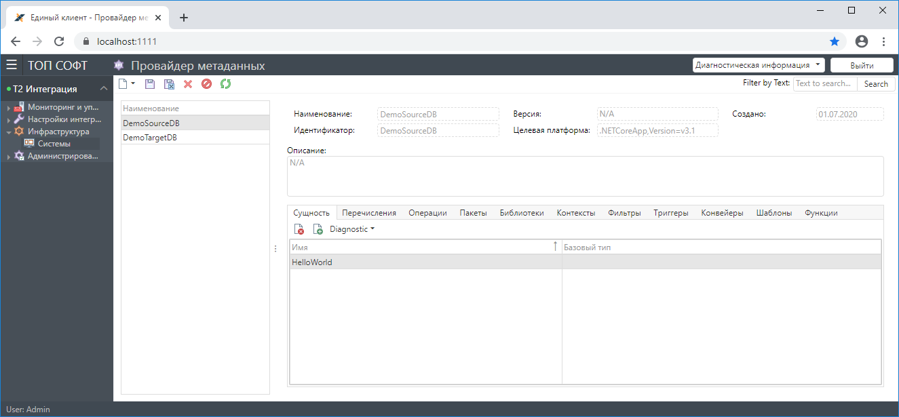

## Создание сущности

Перейдите в меню **Настройки интеграции \ Пользовательская модель** и создайте сущность **HelloWorld** в соответствии с рисунками ниже:


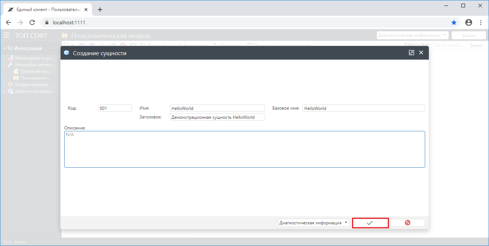


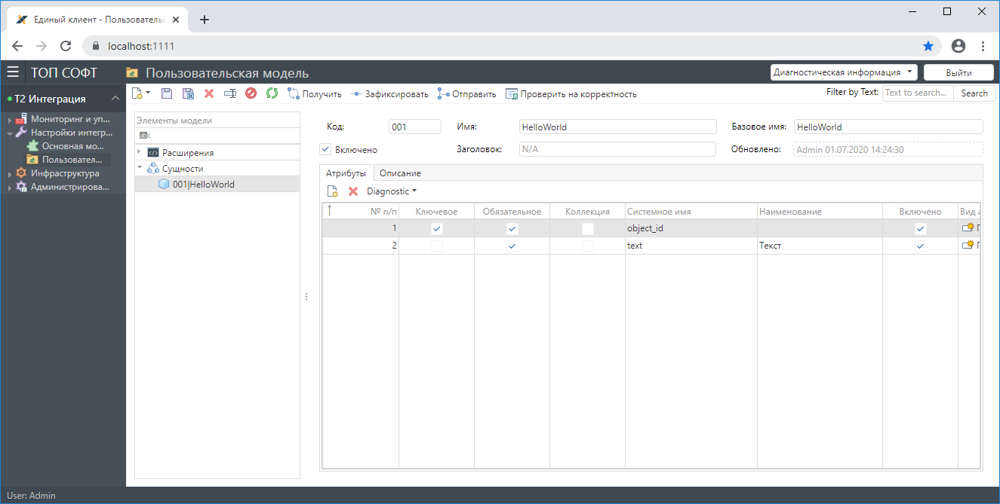

## Создание конвейеров

Установите курсор на сущность **HelloWorld** и создайте конвейер на отправку в соответствии с рисунками ниже:

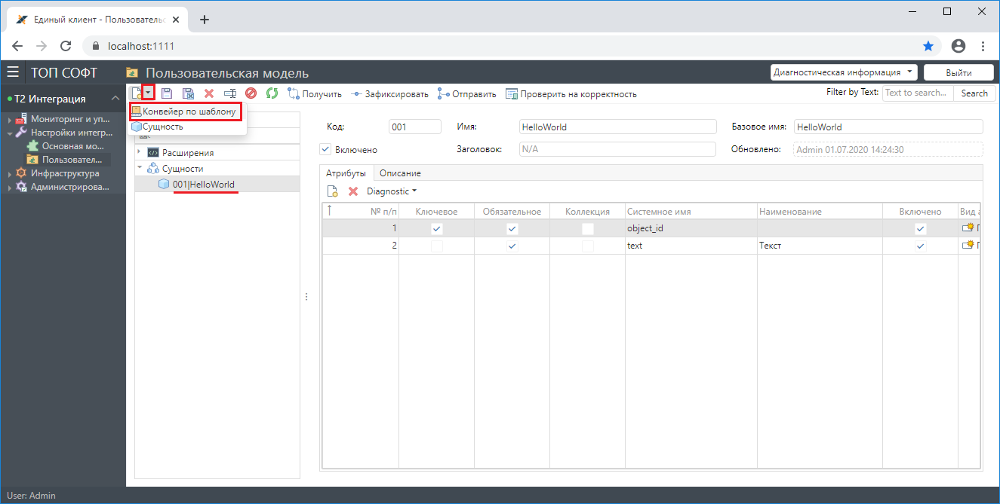


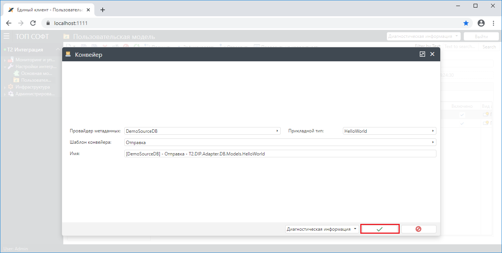


Для операции **Сопоставить объекты ИС с объектами передачи** задайте следующее сопоставление:

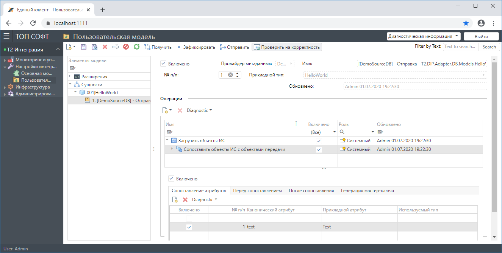


Для сущности **HelloWorld** создайте конвейер на получение:

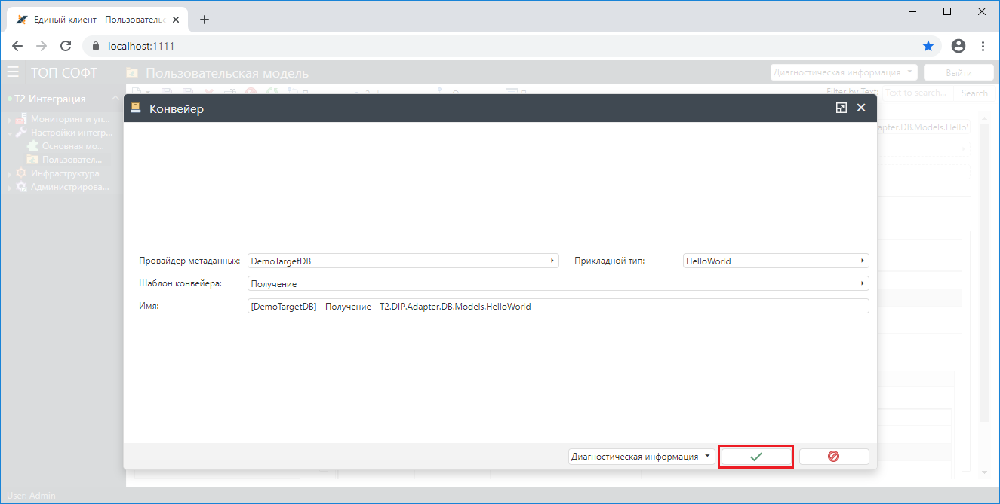


Для операции **Сопоставить объекты передачи с объектами ИС** задайте следующее сопоставление:


= Фиксация изменений в пользовательской модели =

Нажмите кнопку **Зафиксировать** для фиксации сделанных изменений в **Пользовательской модели**:

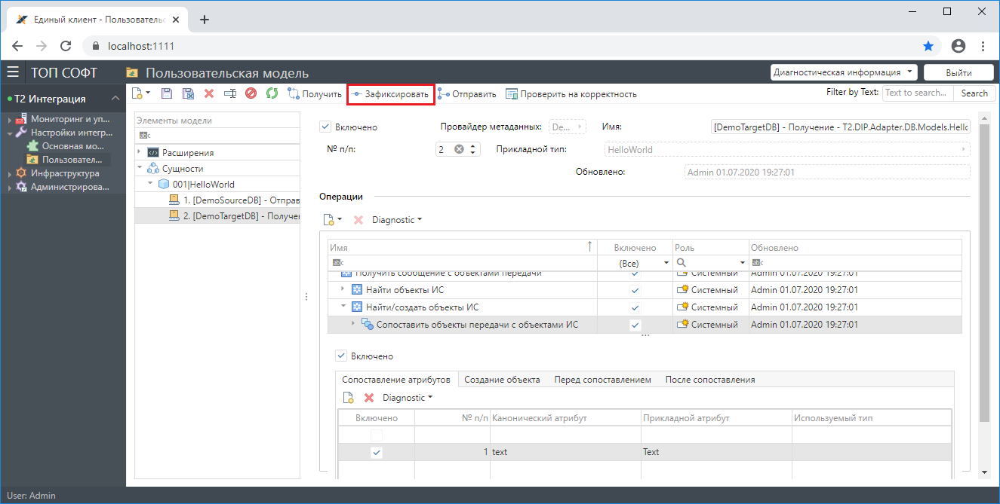


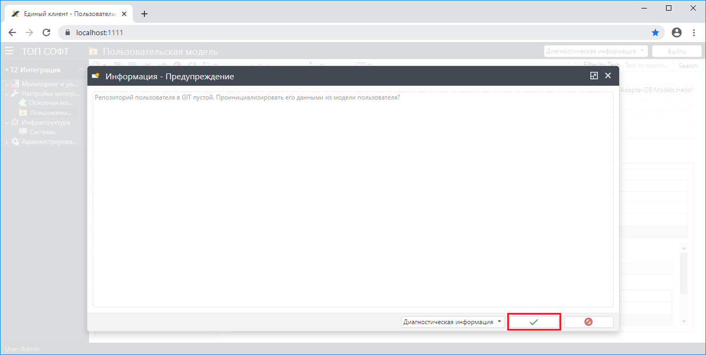


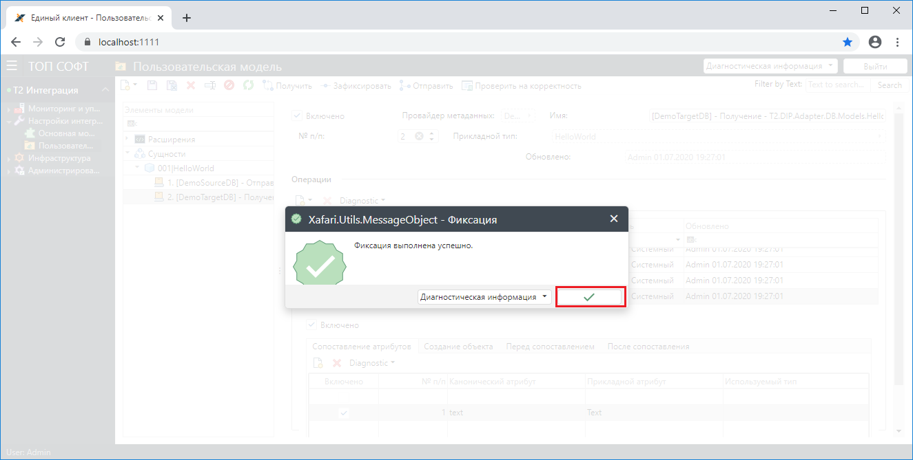


= Отправка изменений в основную модель =

Нажмите кнопку **Отправить**. Таким образом данные из **Пользовательской модели** будут перенесены в **Основную модель**.


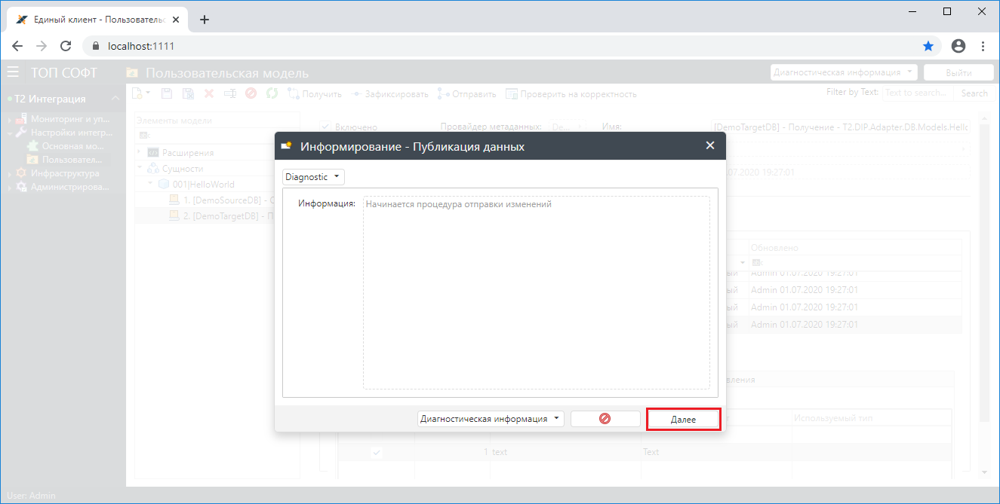


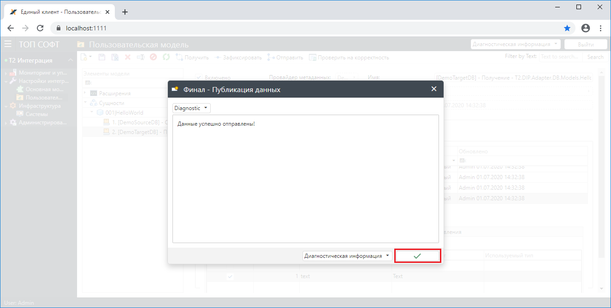


Перейдите в меню **Настройка интеграции \ Основная модель** и убедитесь, что в ней появилась сущность **HelloWorld** из **Пользовательской модели**:

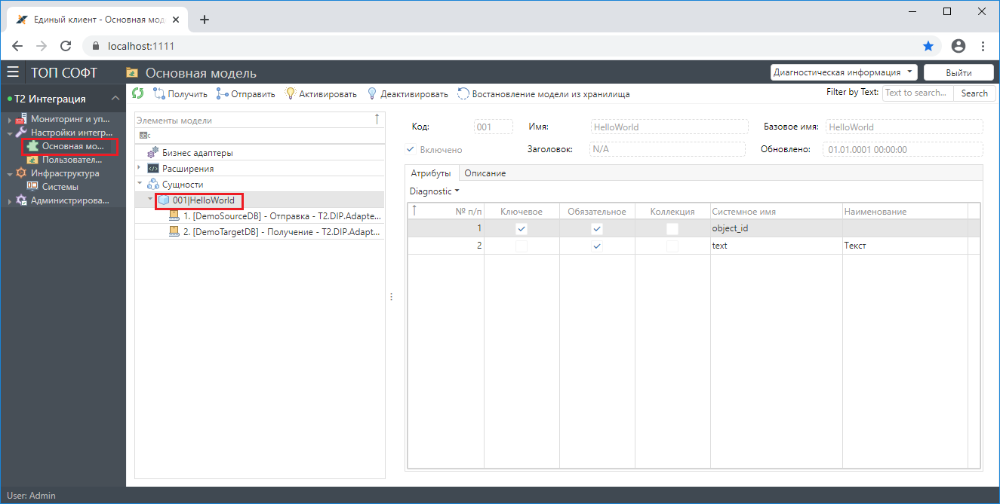


## Создание бизнес-адаптеров и триггеров

Для систем **DemoSourceDB** и **DemoTargetDB** создайте бизнес-адаптеры в соответствии с рисунками ниже: 

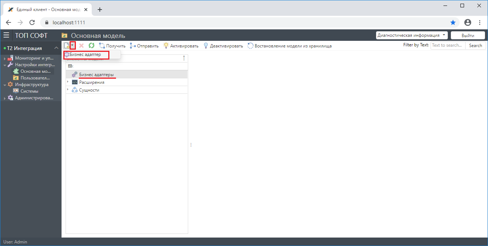


Для бизнес-адаптера **DemoSourceDBBA** создайте триггер на таблицу **HelloWorld** в соответствии с рисунками ниже: 

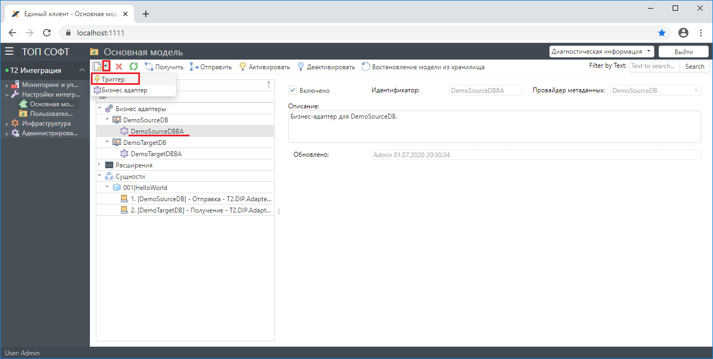


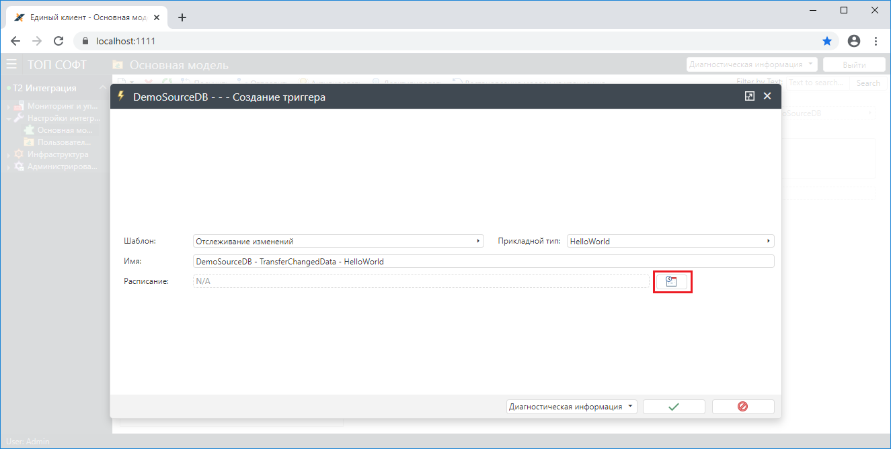


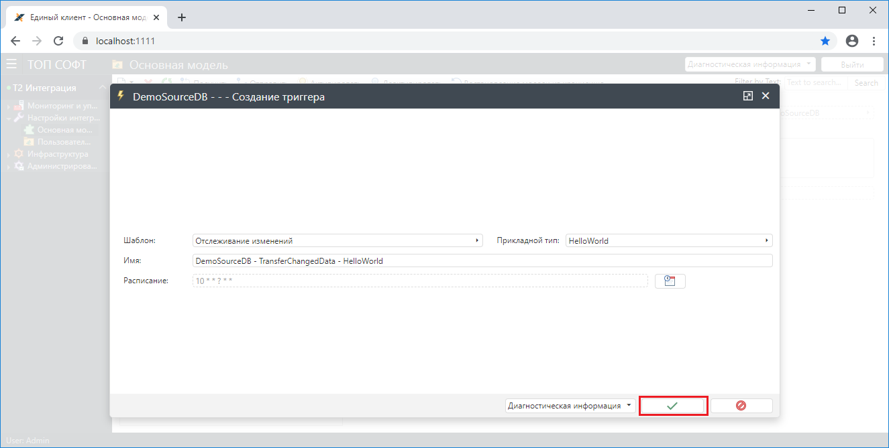


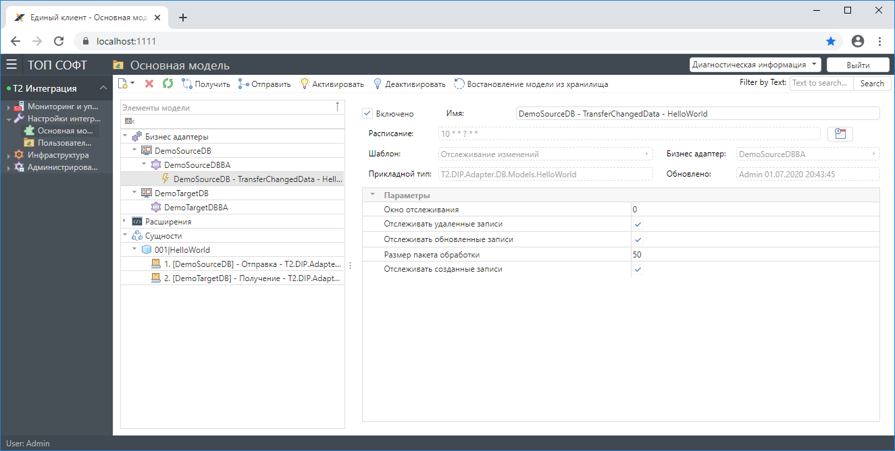

## Активация интеграции

Нажмите кнопку **Активировать** для активации **Основной модели**:


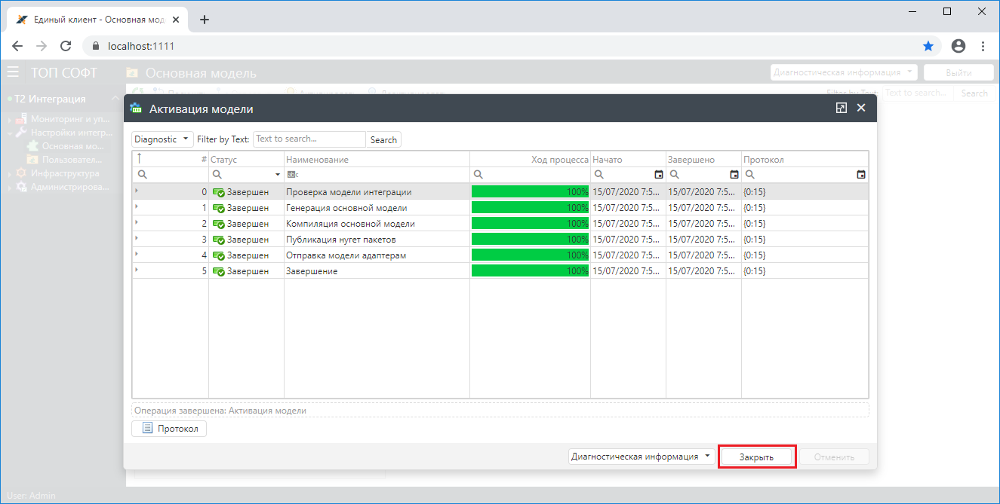

## Запуск синхронизации данных

В **SQL Server Management Studio** выполните следующую команду для имитации модификации данных в таблице **HelloWorld** в БД-источнике:

    UPDATE [T2.DemoSourceDB].[dbo].[HelloWorld] SET Text = Text;

Передача данных в БД-приемник выполнится автоматически максимум через 10 секунд.

## Результат передачи данных

Выполните команду чтения данных из таблицы **HelloWorld** в БД-приемнике:

    SELECT * FROM [T2.DemoTargetDB].[dbo].[HelloWorld];

Результатом будет строка следующего вида:

    Id   Text
    ---  ----------------------------------------------
      1  Hello World from T2.DemoSourceDB!

