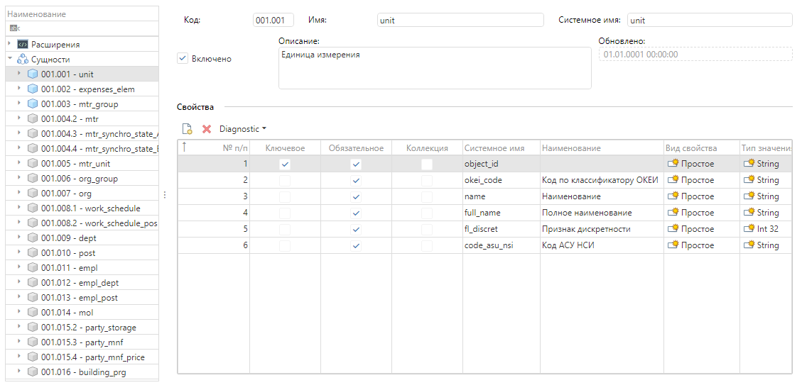

Модель интеграции состоит из:
[[toc]]

## Системы

В **Т2 Интеграция** все интегрируемые между собой объекты (информационные системы, сервисы, порталы, обособленные БД и т.п.) называются **системами**.

**Система** - в контексте **Т2 Интеграция** представляет собой информационный объект, содержащий информацию об имени и метаданных соответствующего объекта интеграции.

В сервере настройки модели интеграции, системы появляются автоматически, в процессе регистрации адаптеров. Т.е. каждый адаптер, запускаемый впервые, регистрируется в сервере, т.е. фаормирует и передает на сервер метаданные обслуживаемой им системы.

После того как системы зарегистрирована в сервере, она может быть использована при настройке модели интеграции.

## Сущности

**Сущность** - в контексте **Т2 Интеграция** представляет собой описание для определенного типа передаваемых объектов.

Каждая сущность характеризуется уникальным именем и набором присущих ей свойств. Обязательным свойством для любой сущности является [мастер-ключ](model\masterkeys.md), выступающий в качестве идентификатора объектов сущности. По умолчанию для мастер-ключа используется имя **object_id**.

Свойства могут быть как простыми так и ссылочными. Простое свойство - это свойство   предназначенное для простых типов (integer, string, DateTime, double и т.д.). Ссылочные свойства - это ссылки на другие сущности. Наример, у сущности `Подразделение` может быть свойство `Руководитель` которое является ссылкой на сущность `Сотрудник`. Ссылочные свойства, в свою очередь, делятся на два вида: 

- **Свойство-ссылка** - это свойство в качестве значения которого выступает [мастер-ключ](model%5Cmasterkeys.md) связанной сущности. В соответсвии с примером, это будет [мастер-ключ](model%5Cmasterkeys.md) записи `Сотрудника`.

- **Вложенный объект** - это свойство в качестве значения которого выступает вся запись связанной сущности `Сотрудник`, со всеми ее свойствами.

Сущность также может содержать свойства-коллекции. Любые свойства могут коллекциями. Например, сущность `Заказ` может содержать свойство-коллекцию `Позиции заказа` в котором будет список записей сущности `Продукт`.

Совокупность сущностей и свойст представлят собой структуру, аналогичную реляционным БД. При интеграции, данные передаются в виде текстовых сообщений и данная структура определяет содержимое передаваемых сообщений. Она используется для сериализации\десериализации при отправке\получении сообщений.

Пример настройки сущности:



## Мастер-ключи

**Мастер-ключ** - уникальный ключ передаваемого объекта в пределах текущей **сущности**. Мастер-ключ, в общем случае, представляет собой строку. У каждого передаваемого объекта должен быть мастер-ключ.

При передаче объектов из систем-источников все внутренние ключи передаваемых объектов автоматически подменяются на мастер-ключи. При получении объектов в системах-приемниках мастер-ключи получаемых объектов автоматически заменяются на внутренние ключи.

По умолчанию при передаче объекта **Т2 Интеграция** автоматически генерирует значение мастер-ключа в формате [GUID](https://ru.wikipedia.org/wiki/GUID), если для объекта еще не был задан мастер-ключ.

## Конвейеры

**Конвейер** - это способ обработки исходящих или входящих сообщений.  Как и на каком-нибудь предприятии, где на конвейер подается заготовка, которая, пройдя через определенный набор технологических операций, на выходе приобретает вид готового изделия и отправляется на склад для дальнейшей отправки потребителю, так и в **Т2 Интеграция** данные, передаваемые на вход, трансформируются при помощи различных операций-алгоритмов, и по окончании обработки отправляются в брокер сообщений для дальнейшей отправки потребителям. Для каждой сущности может существовать множество конвейеров, которые могут выполнятся одновременно, так и по определенным условиям.

Различают 2 типа конвейеров:

1. **Конвейер на отправку**. Описывает правила обработки данных при их передаче от системы до брокера сообщений.
2. **Конвейер на получение**. Описывает правила обработки данных при их передаче от брокера сообщений до системы.

В зависимости от того, является система источником или приемником для сущности, используется соответствующий тип конвейера.

Конвейер состоит из совокупности операций. Операция конвейера описывает определенное простое действие по обработке данных (примеры: получение объектов из системы, фильтрация передаваемых объектов, сопоставление объектов, типовая обработка списка передаваемых/получаемых объектов, сохранение объектов в системе).

### Пример настройки конвейера на отправку:

### Пример настройки конвейера на получение:

## Операции

**Операция** - элемент конвейера, выполняющий определенные действия по обработке данных.

Операции конвейера могут быть нескольких типов:

- **специализированные**,
- **фильтры**.

## Сопоставления

**Сопоставление** - установка соответствия между типом данных **системы** и **сущностью**.

Различают **явное** и **неявное** сопоставление.

**Явное сопоставление** представляет собой однозначное соответствие определенных свойств типа/класса данных **системы** свойствам **сущности**. 

Пример явного сопоставления данных в виде схемы:


**Неявное сопоставление** данных предполагает дополнительную, более сложную, обработку объектов при преобразовании, что требует написания программного кода по преобразованию. В **Т2 Интеграция** есть возможность использовать программный код на **C#** для дополнительной обработки преобразуемых объектов.

При отправке данных для преобразования объектов системы в объекты передачи доступны следующие виды программных скриптов:

- Генератор мастер-ключа,
- Перед сопоставлением,
- После сопоставления.

При получении данных для преобразования объектов передачи в объекты системы доступны следующие виды программных скриптов:

- Создание объекта,
- Перед сопоставлением,
- После сопоставления.

Пример программного скрипта "После сопоставления":

```
logger.LogInformation("После сопоставления (B): unit");

// Установка признака "Делимость"
appEntity.Делимость = (mainEntity.fl_discret == (System.Int32)0);

// Установка статуса объекта
appEntity.СтатусОбъекта = Xafari.BC.StatusTypes.Published;

Logger.LogInformation("После сопоставления (E): unit");
```

Внешний вид настройки явного сопоставления:


Внешний вид настройки программного скрипта для неявного сопоставления:


## Расширения

**Расширения** - это дополнительные программные пакеты и функции, программируемые непосредственно в модели интеграции и которые могут использоваться в программных скриптах в операциях конвейеров.