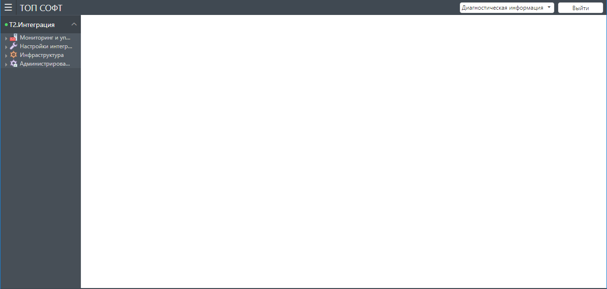
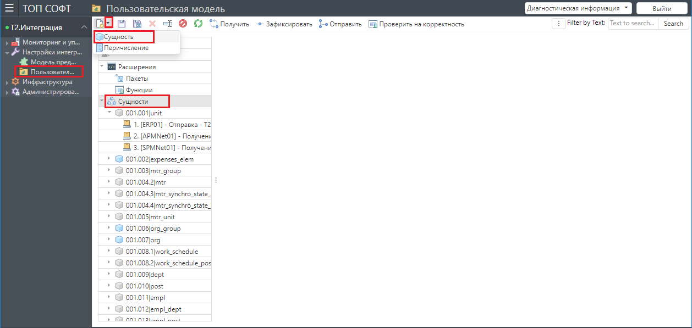
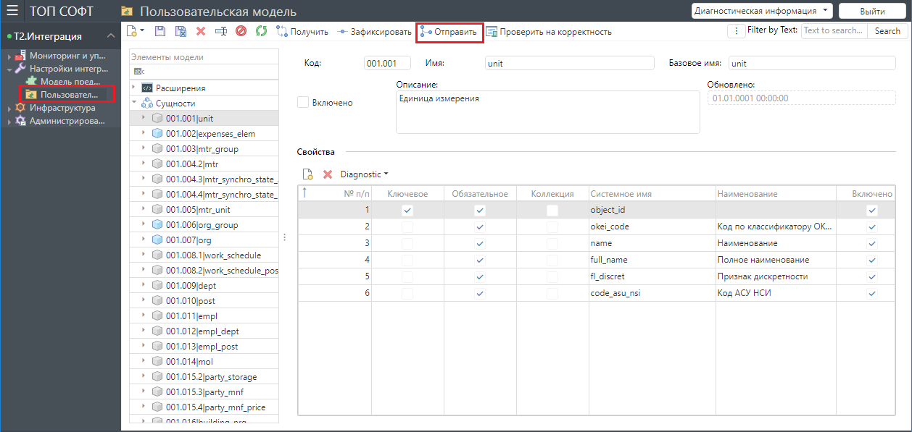
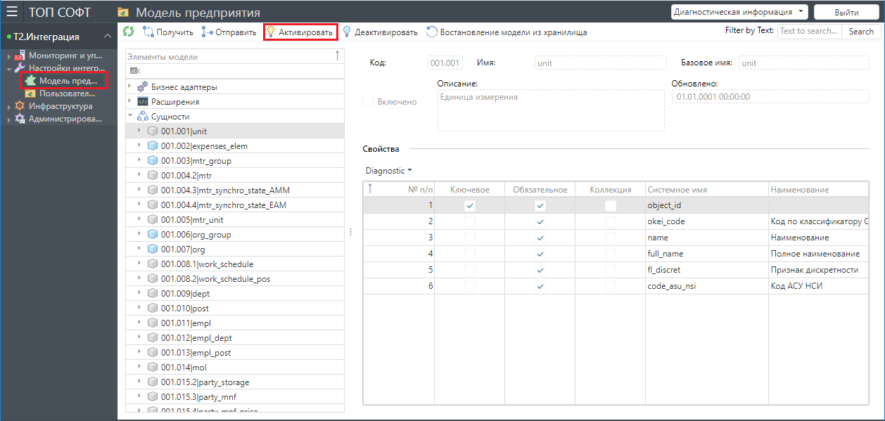

## Вход в Систему

Откройте браузер (Google Chrome, Internet Explorer, Opera, Mozilla) и перейдите по ссылке, соответствующей серверу настройки **Т2 Интеграция** (шаблон ссылки будет примерно следующий: **https://<имя_сервера>/xum**).

После выполнения авторизации откроется главное окно интерфейса пользователя:

## Анализ доступных систем

Просмотр списка **систем**, доступных для интеграции, а также их метаданных, выполняется по пункту меню **Инфраструктура \ Системы**. Информация по каждой **системе** формируется автоматически при первом запуске её адаптера и автоматически обновляется после установки обновлений системы. Подробное описание структуры метаданных представлено **здесь**.  

## Проектирование интеграции

Проектирование интеграции, как правило, выполняется бизнес-аналитиками и начинается с анализа проблем, связанных с несоответствием однородных данных в различных информационных системах, используемых на предприятии. Поcле выделения таких данных 
процесс проектирования интеграции выполняется непосредственно в **Т2 Интеграция** (меню **Настройки интеграции \ Пользовательская модель**) и состоит из следующих этапов:
1. **Создание сущностей**. Для каждого типа данных, которые должны быть засинхронизированы между системами, создается одна или несколько сущностей, которые будут являться основой для описания процессов передачи данных, их структуры и правил их преобразования.
2. **Описание процессов передачи данных**. Для каждой созданной сущности в виде форматированного текста указываются система-источник и системы-приемники, описываются бизнес-операции и условия, приводящие к передаче данных, а также условия приема данных. Описание на этой вкладке должно быть понятным для пользователей всех задействованных систем.
3. **Создание наборов атрибутов для сущностей**. Для каждой сущности создается набор атрибутов, которые определяют, что именно должно передаваться по этой сущности.
4. **Публикация результатов проектирования**. Для того, чтобы результаты проектирования интеграции стали доступны остальным пользователям Т2 Интеграция, выполняется их отправка из пользовательской модели текущего пользователя в модель предприятия.

## Создание сущностей

Настройка интеграции **систем** выполняется через пункт меню **Настройки интеграции \ Пользовательская модель**. В панели слева отображается 2 группы данных - **Расширения** и **Сущности**.

В группе **Расширения** задаются дополнительные ресурсы, общие программные блоки и т.п., которые используются в дальнейшем в программных скриптах при настройке операций **конвейеров**.

В группе **Сущности** выполняются основные действия по описанию структуры передаваемых данных в виде **сущностей**, а также правила их отправки/получения в виде **конвейеров** применительно к паре "сущность - тип данных системы".

Более подробное описание по настройкам интеграции находится **здесь**.

## Описание процессов передачи

Описание процесса передачи сущности выполняется на одноименной вкладке в карточке сущности:

Пример описания процесса передачи:

    Система-источник:
      HCM.
  
    Системы-приемники:
      APM, ERP, SPM.
  
    Операции, приводящие к передаче:
    
      Добавление новой записи в справочнике сотрудников в HCM:  
        Условия передачи данных из HCM:
          В справочник сотрудников добавлена новая запись в статусе "Опубликован".
        Правила обработки при передаче данных из HCM:
          1. На основе добавленной записи о сотруднике сформировать объект текущей сущности.
          2. Сформированный объект упаковать в сообщение и отправить в брокер сообщений.
        Правила обработки при приеме данных в APM:
          1. На основании полученного объекта текущей сущности создать соответствующий объект системы с типом "Сотрудник".
          2. Для сформированного объекта системы установить статус "Опубликован".
        Правила обработки при приеме данных в ERP:
          1. На основании полученного объекта текущей сущности создать соответствующий объект системы с типом "Сотрудник".
          2. Для сформированного объекта системы установить статус "В работе".
        Правила обработки при приеме данных в SPM:
          1. На основании полученного объекта текущей сущности создать соответствующий объект системы с типом "Сотрудник".
          2. Для сформированного объекта системы установить статус "Опубликован".
  
      Изменение записи в справочнике сотрудников в HCM:  
        Условия передачи данных из HCM:
          В справочнике сотрудников изменена запись в статусе "Опубликован".
        Правила обработки при передаче данных из HCM:
          1. На основе измененной записи о сотруднике сформировать объект текущей сущности.
          2. Сформированный объект упаковать в сообщение и отправить в брокер сообщений.
        Правила обработки при приеме данных в APM:
          1. На основании полученного объекта текущей сущности найти (при необходимости - создать) и скорректировать соответствующий объект системы с типом "Сотрудник".
          2. Для сформированного объекта системы установить статус "Опубликован".
        Правила обработки при приеме данных в ERP:
          1. На основании полученного объекта текущей сущности найти (при необходимости - создать) и скорректировать соответствующий объект системы с типом "Сотрудник".
          2. Для сформированного объекта системы установить статус "В работе".
        Правила обработки при приеме данных в SPM:
          1. На основании полученного объекта текущей сущности найти (при необходимости - создать) и скорректировать соответствующий объект системы с типом "Сотрудник".
          2. Для сформированного объекта системы установить статус "Опубликован".
  
      Удаление записи в справочнике сотрудников в HCM:  
        Условия передачи данных из HCM:
          В справочнике сотрудников удалена запись.
        Правила обработки при передаче данных из HCM:
          1. На основе удаленной записи о сотруднике сформировать сообщение об удалении объекта текущей сущности.
          2. Отправить сформированное сообщение в брокер сообщений.
        Правила обработки при приеме данных в APM:
          1. На основании полученного сообщения об удалении объекта текущей сущности найти соответствующий объект системы с типом "Сотрудник".
          2. Удалить найденный объект системы.
        Правила обработки при приеме данных в ERP:
          1. На основании полученного сообщения об удалении объекта текущей сущности найти соответствующий объект системы с типом "Сотрудник".
          2. Удалить найденный объект системы.
        Правила обработки при приеме данных в SPM:
          1. На основании полученного сообщения об удалении объекта текущей сущности найти соответствующий объект системы с типом "Сотрудник".
          2. Удалить найденный объект системы.

## Создание атрибутов сущности

Создание атрибутов сущности выполняется на вкладке **Атрибуты**. Подробное описание по вводу атрибутов для сущности см. **здесь**.

## Публикация результатов проектирования

## Перенос настроек интеграции в модель предприятия

Для того, чтобы настройки интеграции, выполненные в пользовательской модели, можно было активировать, необходимо перенести эти настройки в модель предприятия. Перенос выполняется в автоматическом режиме при нажатии кнопки **Отправить** в пользовательской модели:

## Настройка интеграции

## Активация интеграции

Для того, чтобы системы начали обмениваться между собой информацией, необходимо активировать заданные настройки интеграции. Активация выполняется в модели предприятия (меню **Настройки интеграции \ Модель предприятия**) при нажатии кнопки **Активировать**:

